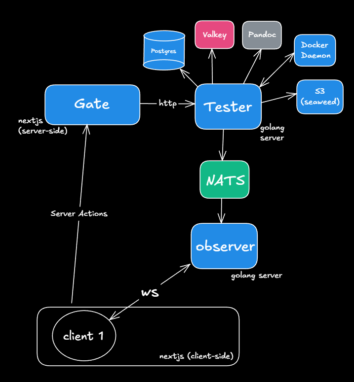

# Documentation for The Gate system

This repository contains documentation for the Gate system.
It provides a complete overview of the architecture, components and functionality of the system.
Screenshots, illustrations and explanations included.

I poured a lot of effort into this project, which is deeply rooted in a personal story from my life.
Writing the documentation now feels like sharing a piece of that journey.

### Table of contents

1. [The story of the Gate system](#the-story-of-the-gate-system)
    * [Introduction](#introduction)
    * [From the old, gray past](#from-the-old-gray-past)
2. [The architecture of the Gate system](#the-architecture-of-the-gate-system)
    * [In simple words](#in-simple-words)
    * [Diving deeper](#diving-deeper)
    * [Technical decisions](#technical-decisions)
    * [Future plans](#future-plans)
3. [It seems to be easy - but it's not](#it-seems-to-be-easy---but-its-not)
    * [LaTeX tables](#latex-tables)
    * [Authentication and Authorization](#authentication-and-authorization)
    * [Real-time updates](#real-time-updates)
    * [Testing solutions](#testing-solutions)

### Project repositories

* [Tester](https://github.com/Vyacheslav1557/tester) - main backend service
* [Gate](https://github.com/Vyacheslav1557/gate) - frontend
* [Observer](https://github.com/Vyacheslav1557/observer) - websocket service
* [Contracts](https://github.com/Vyacheslav1557/contracts) - openapi3 contract
* [Images](https://github.com/Vyacheslav1557/images) - runtime environment
* [Docs](https://github.com/Vyacheslav1557/docs) - you are here

# The story of the Gate system

## Introduction

The Gate system is a platform for competitive programming.
It provides a user-friendly interface called [Gate](https://github.com/Vyacheslav1557/gate) written in nextjs,
typescript.
The whole system is based on a built from scratch RESTful API
called [Tester](https://github.com/Vyacheslav1557/tester) written in Go.
It includes [feature-rich LaTeX support](#latex-tables)
for problem statements, resource management, execution of solutions, real-time updates, sessions and much more.

Here's a screenshot of the Gate interface (Problem page):

## From the old, gray past

The new version of the Gate system is actually a replacement for the old version.

The previous version of the Gate was released in the 2000s.
The system was written as a monolith in PHP.
Then it was supplemented by students with a special interest in programming.
And up to now, the system was considered ancient: it was impossible to add new features, change the UI, etc.

The new version of the Gate system is considered to solve the problems of the old.
It is more flexible, more modern, more user-friendly, developed as separate services, so it is easier to maintain.

Here's a screenshot of the old Gate interface (Problem page):

# The architecture of the Gate system

## In simple words

There are two main services: Gate and Tester. Gate is a user interface for Tester.
Tester is the core, the backend, RESTful API. There is also a third service for websockets called Observer.

The Gate service basically provides a user interface for the Tester service.
It wraps raw data in a React application and provides a user-friendly interface.

Tester provides a set of endpoints for managing problems, solutions, contests, users, etc.

## Diving deeper

### Tester

As mentioned, the Tester in written in Go. It is a RESTful API.

It uses openapi3 to define the API. Tester is written in Clean Architecture style, so it is easy to understand and
maintain. Independent components can be decoupled from each other. For example, all the auth logic can be moved to
another service as well as the notifications via websocket (done in Observer). It uses RBAC for authorization.

Tester includes a feature-rich LaTeX support for problem statements based on Pandoc. When user edits a problem
statement,
tester automatically converts the problem statement to HTML.
Read [this](#latex-tables) to understand why.

All the relatively small data (users, contests, problems, solutions) is stored in Postgres.
Tester provides CRUD endpoints for these resources. All the tests (large data) is stored in S3 (seaweedfs).
User sessions (auth) can change frequently, so they are stored in Valkey (Redis fork).

Docker is used to evaluate solutions in an isolated environment.

### Observer

The websocket API is used for real-time solution updates notifications. So the user can see the results of his solution
immediately. Without needing to reload the page.

### Gate

The Gate service is a user interface for the Tester service. It wraps raw data in a React application and provides a
user-friendly interface. It uses openapi3 schema defined in Tester to call Tester endpoints.

SSR is used for the fetching of data. So it can be easily cached. CSR is used for the reactive user interface.

Mantine is used for the UI. It is a React ui-kit for web and mobile apps. Some cool features like code highlighting and
math rendering are provided out of the box. It is easy to use and maintain.

## Technical decisions

The Gate system was divided into two main services: Gate and Tester. The contract between them is strictly defined
by openapi3. That solves the problem of maintaining the whole system. Someone who knows nextjs can easily add new
features to the Gate, while someone who knows Go can easily add new features to the Tester.

## Future plans

The Gate system is still in development. There are a lot of features to implement. But the MVP is done.

At the time of writing this (23.05.2023), the following is planned:

#### Tester:

* Move notifications to a separate service
* Move the whole testing logic to a separate service
* Integrate monitoring tools (prometheus, grafana)
* Integrate logging tools (logtail, sentry)
* Integrate tracing tools (jaeger, opentelemetry)
* Add caching layer

#### Gate:

* Integrate monitoring tools (prometheus, grafana)
* Improve UI so the mobile users can get the same support

#### Courses:

A new service for creating and publishing courses. It will be implemented in the near future.
It is needed for teachers (and students) to share their knowledge. All the current projects and courses that exist now
(sql course, Qt course, Huffman archiver, Golang course, etc.) will be migrated to the new service.

#### Testing module:

A new service for testing the students' knowledge. It will be implemented in the near future.
It is needed for teachers (and students) to easily hold tests, small events like olympiads, etc.

#### Olymphub:

A new service for posting some key information about olympiads and other school events.
With notifications and telegram bot support. Currently, in deep development.

#### Schedule:

A new service for archiving the schedule. Our regional school schedule system is sometimes unavailable.
So there must be a way to save the schedule and access it when needed.

# It seems to be easy - but it's not

## LaTeX tables

Default LaTeX rendering libraries (MathJax, KaTeX, etc.) do not support tables.
But the Gate system uses [Pandoc](https://pandoc.org/) to convert LaTeX to HTML.
Pandoc can convert LaTeX tables to HTML tables (and more).

## Authentication and Authorization

Nextjs server and client side must have some information about the user (role, id, etc.)
without fetching it every time.
The Gate system uses [Valkey](https://github.com/Vyacheslav1557/valkey) for storing user sessions.
Session is transported as JWT token, so the nextjs server can get user info from the token.

## Real-time updates

Observer uses Websocket API for real-time updates. Tester and Observer communicate via NATS.
So the user can see the results of his solution immediately.
The messaging contract was developed from scratch.
It uses self-written solution state monitoring logic.

## Testing solutions

Tester uses Docker to evaluate solutions in an isolated environment.
Because Docker is a container runtime, it is easy to manage the environment via docker images,
therefore it is easy to test solutions.